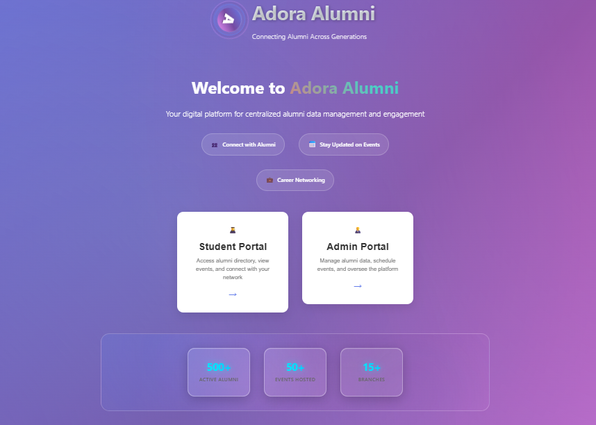
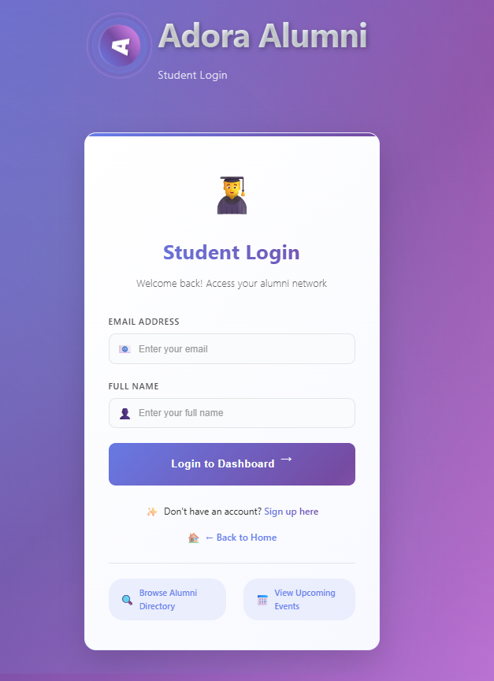
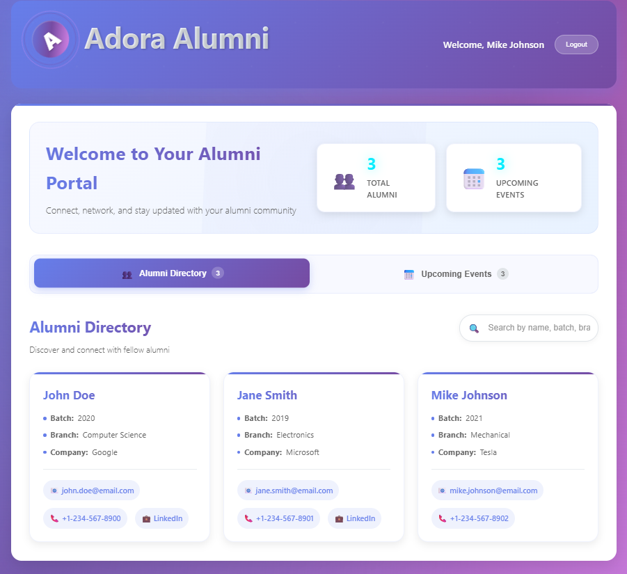
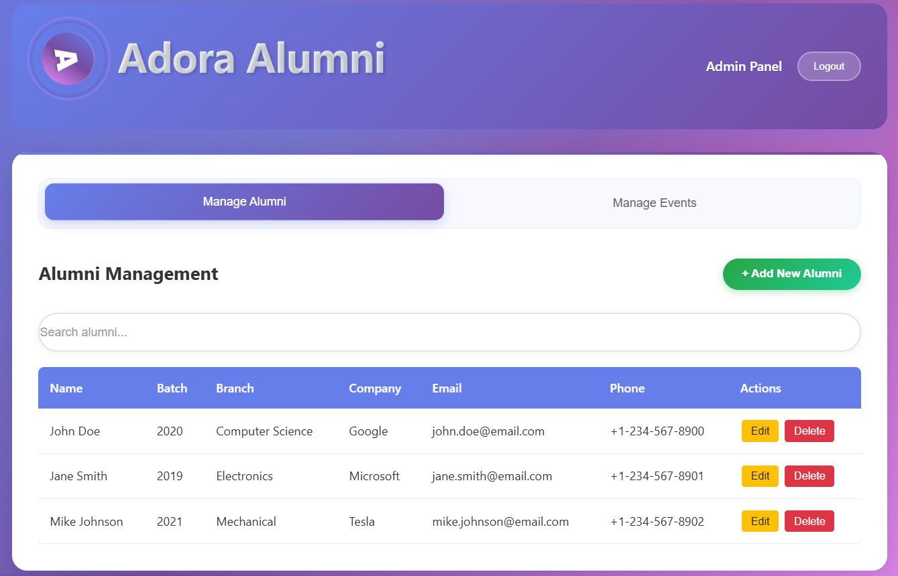

# Adora Alumni 🎓

A comprehensive Streamlit web application for centralized alumni data management and engagement, built with Python and Firebase.

## Features

### 🏠 Landing Page
- Clean, modern interface with Student and Admin portal options
- Responsive design with custom CSS styling

### 👨‍🎓 Student Portal
- **Sign Up/Login**: Complete registration with personal and academic details
- **Alumni Directory**: Browse and search through alumni database
- **Events**: View upcoming alumni events
- **Profile Management**: View and manage personal information

### 👨‍💼 Admin Portal
- **Secure Login**: Admin authentication system
- **Alumni Management**: Add, edit, and delete alumni records
- **Event Management**: Schedule and manage alumni events
- **Statistics Dashboard**: View analytics and insights

- ## 📸 Screenshots

### 🏠 Landing Page


---

### 🔐 Student Login


---

### 📊 Student Dashboard

---

### 📅 Events Section

---

### ⚙️ Admin Dashboard


## 📁 Project Structure
```
adora-alumni
│
├── app.py
├── auth.py
├── database.py
├── landing.py
├── student_auth.py
├── student_dashboard.py
├── admin_auth.py
├── admin_dashboard.py
│
├── firebase_config.py
├── firebase_service.py
│
├── requirements.txt
├── README.md
├── .gitignore
│
└── screenshots
    ├── landing.png
    ├── student_login.png
    ├── student_dashboard.png
    ├── events.png
    └── admin_dashboard.png
```
## Setup Instructions

### 1. Install Dependencies
```bash
pip install -r requirements.txt
```

### 2. Firebase Configuration
1. Create a Firebase project at [Firebase Console](https://console.firebase.google.com/)
2. Enable Realtime Database
3. Download your service account key JSON file
4. Create a `.env` file based on `env_example.txt`:
```env
FIREBASE_API_KEY=your-api-key-here
FIREBASE_AUTH_DOMAIN=your-project.firebaseapp.com
FIREBASE_DATABASE_URL=https://your-project.firebaseio.com
FIREBASE_STORAGE_BUCKET=your-project.appspot.com
FIREBASE_SERVICE_ACCOUNT_PATH=path/to/serviceAccountKey.json
```

### 3. Run the Application
```bash
streamlit run app.py
```

## Admin Access
Admin users can be managed through the application database for development and testing purposes.

## Database Structure

### Students Collection
```json
{
  "name": "string",
  "batch": "number",
  "branch": "string",
  "email": "string",
  "phone": "string",
  "company": "string",
  "linkedin": "string",
  "password": "string",
  "created_at": "datetime"
}
```

### Events Collection
```json
{
  "name": "string",
  "date": "string",
  "time": "string",
  "location": "string",
  "description": "string",
  "created_at": "datetime"
}
```

## Technologies Used
- **Frontend**: Streamlit, HTML, CSS, JavaScript
- **Backend**: Python
- **Database**: Firebase Realtime Database
- **Authentication**: Custom implementation with Firebase

## Features Highlights
- 🎨 Modern, responsive UI with custom CSS
- 🔐 Secure authentication system
- 📊 Real-time data management
- 🔍 Advanced search and filtering
- 📱 Mobile-friendly design
- 📈 Analytics and statistics dashboard

## Contributing
Feel free to submit issues and enhancement requests!

## License
This project is open source and available under the MIT License.


